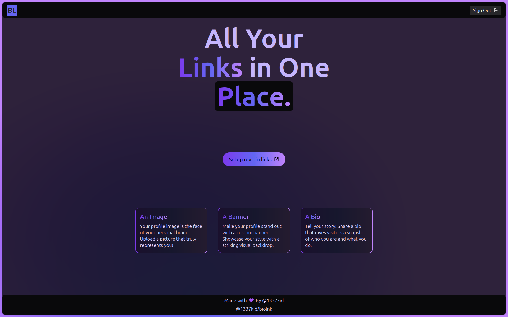

# BioLnk

<div align="center">
  
  <p>
  <a href="https://biolnk.vercel.app" target="_blank">biolnk.vercel.app</a><br/>
<b>BioLnk</b> is a simple yet powerful service for creating a personalized profile page. Add your profile image, a striking banner, and a bio that tells your story. The main feature? Seamlessly add links to all your social platforms, websites, and services in one place. Perfect for sharing across social media! 
</p>
</div>

## Contents

- [**Features**](#features)
- [**Installation**](#installation)
- [**Gallery**](#gallery)
- [**Team Memebers**](#team-members)

## Features

- **Profile Image**: Upload a profile picture that represents your personal brand.
- **Custom Banner**: Add a unique banner to make your profile stand out.
- **Bio Section**: Share a brief description about yourself or your brand.
- **Link Integration**: Add and manage links to your social media profiles, websites, and other services, all in one place.
- **Responsive Design**: Works seamlessly across mobile and desktop devices.
- **Easy Customization**: Quickly update your profile with an intuitive interface.
- **Shareable Profile**: Get a custom URL to share your profile easily across all platforms.


## Installation
#### Environment variables example
```bash
SUPABASE_URL="https://[REDACTED].supabase.co"
SUPABASE_ANON_KEY="supabase anon key"
NEXT_PUBLIC_BASE_URL=http://domain.tld
DIRECT_URL="postgresql://postgres.[REDACTED]:[REDACTED]@[REDACTED].pooler.supabase.com:5432/[REDACTED]"
DATABASE_URL="postgresql://postgres.[REDACTED]:[REDACTED]@[REDACTED].pooler.supabase.com:6543/[REDACTED]?pgbouncer=true"
SUPABASE_BUCKET_NAME="supabase storage bucket name here"
```
#### Development
```bash
git clone https://github.com/1337kid/biolnk.git
cd biolnk
npm i
npm run dev
```
#### Build
```bash
git clone https://github.com/1337kid/biolnk.git
cd biolnk
npm i
npx prisma generate && npm run build
```

## Gallery

| Landing Page|Add Data|
:-:|:-:
|  |  |

| Example Profile| In Mobile View|
:-:|:-:
| |  |
